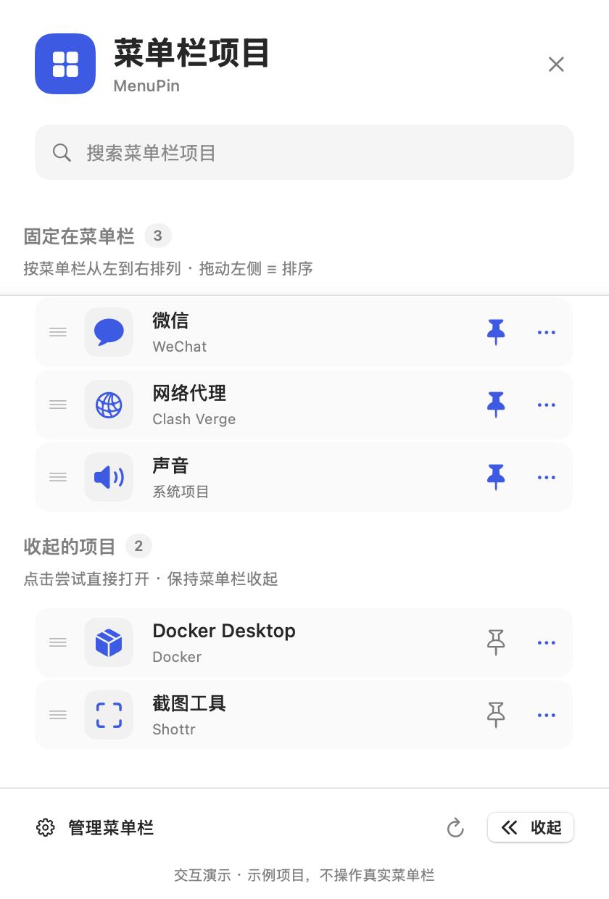

# MenuPin

A native macOS menu bar manager inspired by Chrome's extension panel. Pin or hide items, reorder them with native list dragging, and try opening their original menus from one panel. Built with SwiftUI and AppKit, with no third-party dependencies.

**macOS 13+ · Swift 5.9+ · MIT License**



The screenshot uses sample items. Hidden menu access depends on each application's Accessibility support. The app does not automatically reveal hidden items to open their menus.


参考 Chrome 扩展程序面板的原生 macOS 菜单栏管理器。SwiftUI + AppKit，无第三方依赖，所有设置保存在本机。

## 开始使用

1. 从 [Releases](https://github.com/z1s1n/MenuPin/releases) 获取安装包，或先按下方说明构建。将 `MenuPin.app` 放到“应用程序”，双击启动。
2. 点击右上角四格图标，打开管理面板。
3. 在面板点“打开辅助功能设置”，在 **系统设置 → 隐私与安全性 → 辅助功能** 中添加并开启 MenuPin。系统授权必须由你操作，应用不会自动开启权限。
4. 返回面板点刷新。蓝色实心图钉表示固定在菜单栏；空心图钉表示在收起区。点击图钉切换；拖动左侧 ≡ 横线，在同组项目之间选择插入位置。更多菜单可向左 / 向右移一位。点击名称尝试打开原菜单。
5. 点面板右下角“收起”，隐藏分隔线左边的项目。固定项目保留在分隔线右侧。再次点 MenuPin，可以管理收起的项目。

如果分隔线出现在四格图标右边，按住 **⌘ Command** 把分隔图标拖到四格图标左边，再刷新。也可以按住 ⌘ 手动将项目拖到分隔线两侧。

## 功能

- 固定 / 收起：实际移动图标；重新扫描确认位置后才保存选择。
- 左右排序：使用原生 List/onMove 拖动左侧 ≡，或更多菜单中向左 / 向右移一位；松手后面板先预览顺序，真实菜单栏完整分组验证成功才保存，失败回到扫描结果。搜索时暂停拖动；遵守“减少动态效果”。
- 点击名称：在当前收起状态下尝试打开原菜单；更多按钮可尝试右键菜单。隐藏 / 待定位项目只调用辅助功能动作，不模拟点击屏幕外坐标，不自动展开整排图标。
- 搜索：按项目名或应用名搜索，中英文、忽略大小写。
- 展开 / 收起：点击分隔线、右键 MenuPin 或面板按钮。
- 自动收起：设置中启用，关闭面板 10 秒后收起；鼠标位于菜单栏或按住鼠标时延后。
- 登录启动：使用 macOS 原生登录项；系统需要批准时会显示提示。
- 保存布局：macOS 保留菜单栏位置；提供稳定 AX 标识的项目会保存图钉和左右顺序，设置中的“恢复保存的图钉和顺序”可重新应用。
- 退出恢复：移除分隔符，释放收起区，所有图标重新可见。

打开管理面板不改变菜单栏的展开 / 收起状态。隐藏项目不支持辅助功能动作时，面板会提示；只有你手动点击“展开”才展开整排图标。辅助功能 API 接受动作不代表第三方一定显示菜单：自定义浮层可能不支持隐藏唤起，或仍将原菜单定位在屏幕外。当前不将第三方菜单镜像到面板，也不临时移入主菜单栏。

## 系统和边界

本次提供的可执行文件为 **Apple Silicon arm64，macOS 13+**，本机 macOS 15.6.1 编译。采用本地 ad-hoc 签名，未做 Developer ID 公证。通过网络下载到其他机器时，如被系统拦截，可在“隐私与安全性”中选择允许打开。

macOS 没有提供直接隐藏第三方菜单栏项目的公开接口。本应用通过拉长分隔区域收起其左侧项目，使用辅助功能和系统鼠标事件定位、移动和点击图标。没有采用私有 API。

- 某些系统项目不允许移动或不提供可操作接口，应用会显示失败原因，不声称移动成功。
- 刘海、菜单栏宽度不足、自动隐藏菜单栏、全屏模式可能导致项目不可见。可切换到桌面、展开菜单栏并刷新，或按住 ⌘ 手动拖动。
- 多屏按屏幕归属分类，源、目标和分隔符必须属于同一屏幕；顶部对齐多屏时，屏幕外项目归属无法确定则标为待定位。复杂镜像、多屏布局仍需要实机验证。
- 未提供稳定 AXIdentifier 的项目使用当前窗口身份或原 AX 元素核对操作，避免序号复用后移动错项目；这些项目不用于跨启动恢复。
- 无权限时显示授权引导，不填充演示项目。

## 源码和构建

安装 Xcode Command Line Tools（或 Xcode）后，克隆仓库并构建：

```sh
git clone https://github.com/z1s1n/MenuPin.git
cd MenuPin
bash test.sh
bash build.sh
```

`build.sh` 在源码目录的上一级生成 `MenuPin.app`；可用 `MENUPIN_APP_PATH` 指定生成位置。可用 Xcode 打开 `Package.swift` 阅读、编辑和运行源码。直接从 Xcode 运行命令行产物时，辅助功能权限所对应的程序路径可能与打包 app 不同；实际使用建议运行打包 app。

源码分层：`MenuPinCore/Models.swift` 负责坐标、分类、稳定标识和搜索；`Scanner.swift` 读取真实项目；`StatusBarEngine.swift` 负责分隔区和鼠标操作；`AppModel.swift` 串联权限、位置验证和保存；`PanelView.swift` 为面板；`Application.swift` 为生命周期。

## 独立演示

```sh
open ../MenuPin.app --args --demo
```

演示会明确标记“示例项目”，支持搜索、图钉交互、拖动和左右排序、设置预览，不读取或改变其他应用图标。

诊断（正常模式，只读取权限和布局，并自动退出）：

```sh
open ../MenuPin.app --args --diagnose /tmp/menupin-diagnostics.json
```

## 技术参考

实现参考了公开的菜单栏收起思路，代码独立编写，未复制第三方源代码。

- [Hidden Bar 机制说明](https://raw.githubusercontent.com/dwarvesf/hidden/develop/docs/ARCHITECTURE.md)
- [Apple CGEvent](https://developer.apple.com/documentation/coregraphics/cgevent)

## 辅助功能已开启但仍未生效

如果系统设置里的 MenuPin 开关已经开启，而应用仍显示“未开启”，在“隐私与安全性 → 辅助功能”中移除 MenuPin，重新添加 `/Applications/MenuPin.app` 并开启，再重新启动应用。

本地 ad-hoc 签名随重新构建变化，macOS 可能保留旧签名的授权记录。2026-10-02 本机日志已确认此情况；安装副本的签名正确，失效的是旧授权记录。不要直接修改系统 TCC 数据库，也无需关闭系统安全保护。重新授权后先使用当前安装版本验证，不要同时重新构建 / 替换应用。

## 1.2 原生拖拽

排序改用 Apple SwiftUI List + .onMove，兼容本机 macOS 15。名称保持单击打开原菜单，左侧 ≡ 是排序拖拽柄，图钉和更多菜单保留独立操作。松手后显示应用进度；真实移动失败不保留预览顺序。跨组拖放不切换图钉，取消拖拽不提交。新 macOS 27 的 reorderContainer 未被使用。

官方参考：[List onMove](https://developer.apple.com/documentation/swiftui/dynamicviewcontent/onmove(perform:))、[Drag and drop HIG](https://developer.apple.com/design/human-interface-guidelines/drag-and-drop)。

## 开源与贡献

代码以 [MIT License](LICENSE) 发布。欢迎通过 [Issues](https://github.com/z1s1n/MenuPin/issues) 报告问题或提交 Pull Request。

报告问题时请提供 macOS 版本、屏幕布局和可复现步骤；请勿上传包含私人应用名称、公司信息或其他敏感内容的完整诊断日志。验证记录见 [VALIDATION.md](VALIDATION.md)。

English build instructions: clone the repository, run bash test.sh and bash build.sh, then launch ../MenuPin.app. Enable Accessibility for the packaged app in System Settings → Privacy & Security → Accessibility. The build uses a local ad-hoc signature; it is not Developer ID notarized. Core tests run without XCTest.
